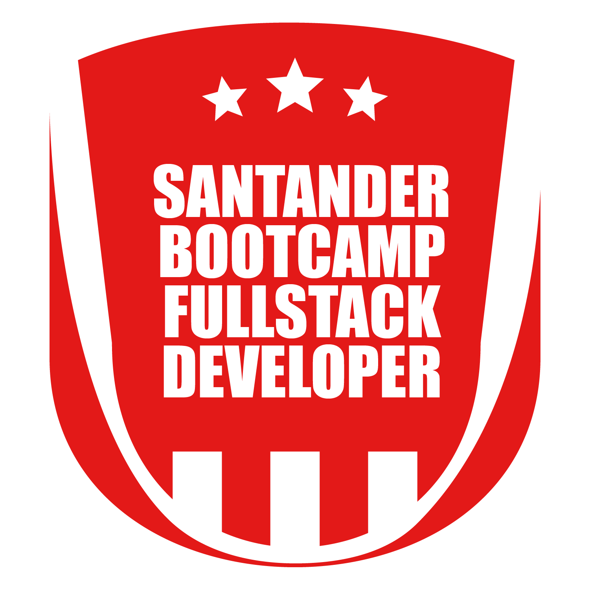

#   Santander Bootcamp Fullstack Developer - Digital Innovation One (DIO)

 ### Tecnologias:

    

Olá 👋, aqui coloco os exercícios de código e projetos que estou estudando no Bootcamp do Santander, bem como os certificados.

### Certificados:

<ul>
    <li>
        
        <a href="https://certificates.digitalinnovation.one/F3F36FAF">Boas-vindas ao Bootcamp Santander Fullstack Developer</a> - 1 hora.
    </li>
    <li>
        
        <a href="https://certificates.digitalinnovation.one/7AB87C4B">Bem-vindo à DIO</a> - 1 hora.
    </li>
    <li>
        
        <a href="https://certificates.digitalinnovation.one/2F5F89D5">Lógica de programação essencial</a> - 4 horas.
    </li>
    <li>
        
        <a href="https://certificates.digitalinnovation.one/ECCD3E86">Introdução ao Git e ao GitHub</a> - 5 horas.
    </li>
    <li>
        
        <a href="https://certificates.digitalinnovation.one/ECCD3E86">
            Conceitos e melhores práticas com bancos de dados PostgreSQL</a> - Estudando...
    </li>
</ul>

